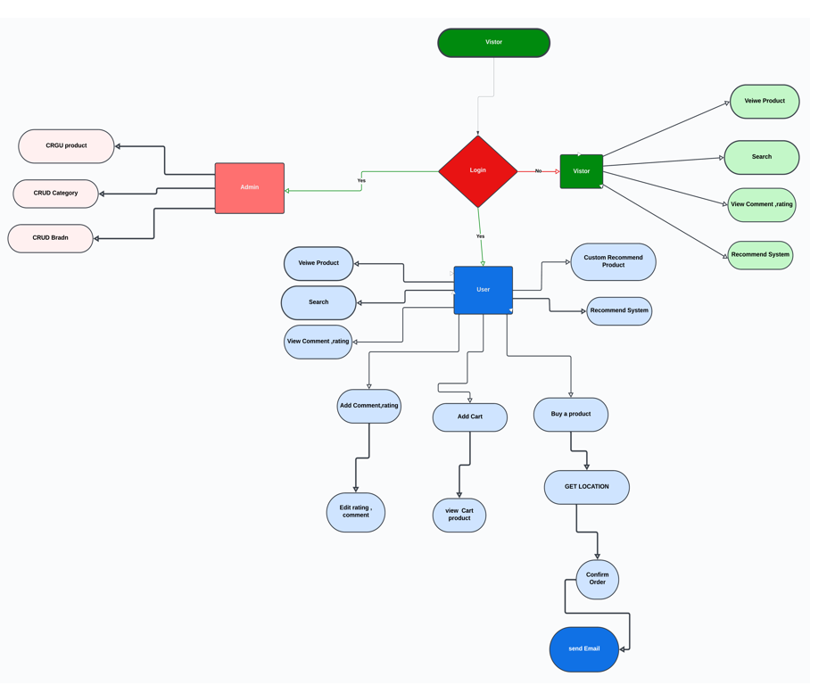

<!DOCTYPE html>
<html>
  <head> </head>
  <body>
    <h1 style="text-align: center">
      E-Commerce project created with Django
    </h1>
    <h2>Table of contents</h2>
    

    <ul id="table-contents">
      <li><a href="#About">About</a></li>
      <li><a href="#Technologies">Technologies</a></li>
      <li><a href="#Postgresql">Postgresql</a></li>
      <li><a href="#UserActivate">UserActivate</a></li>
    </ul>
    

    <section id="About">
      <h2># About</h2>
      

        This is an e-commerce project created using Djnago, Postgresql, Html and CSS
      

      <h3 style="margin-top: 4px">==> Features :</h3>
      <h3 style="margin-top: 4px">==> How to install :</h3>
      <ul>
        <li>
          git clone :
          <a href="https://github.com/OmarAmgad9/e-commerce-graduation-project.git"
            >https://github.com/OmarAmgad9/e-commerce-graduation-project.git</a
          >
        </li>
        <li>python -m venv venv</li>
        <li>venv\Scripts\activate</li>
        <li>source venv/bin/activate</li>
        <li>pip install -r requirements.txt</li>
        <li>python manage.py migrate</li>
        <li>python manage.py runserver</li>
      </ul>
      <h3 style="margin-top: 4px">==> Contact me :</h3>
      

        Email :
        <a href="mailto:omaramgad660@gmail.com">omaramgad660@gmail.com</a>
      

    </section>
    

    <section id="Technologies">
      <h2># Technologies</h2>
      <ul>
        <li>Django</li>
        <li>Postgresql</li>
      </ul>
    </section>
    

    <section id="Postgresql">
      <h2>#Posgresql</h2>
      
    </section>
    

    <section id="Documentation">
      <h2>#UserActivate</h2>
      

      
    </section>
    

  <!-- <section id="view">
      <h2># View</h2>
      <ul>
            <li> </li>
            <li></li>
      </ul>
    </section> -->
  </body>
</html>